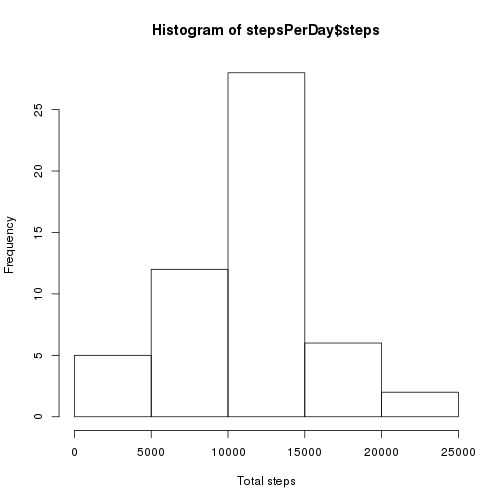
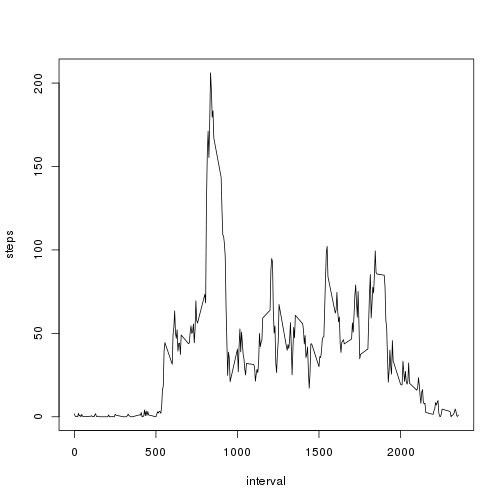
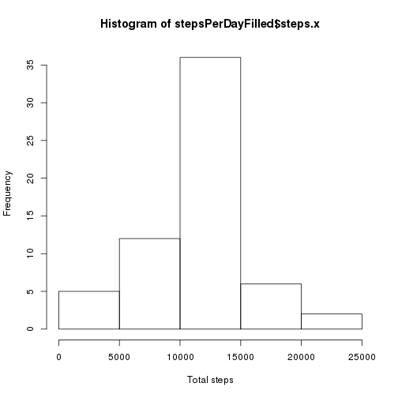
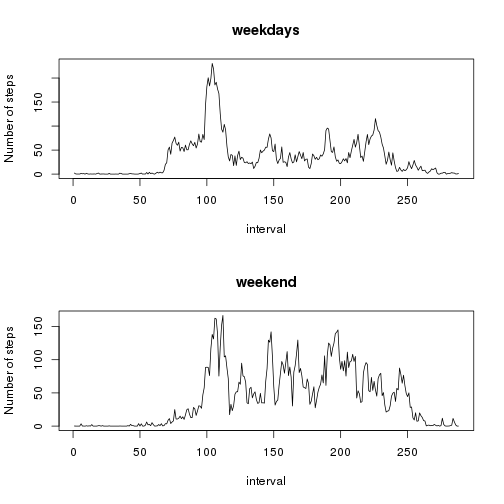

## Loading and preprocessing the data
* Load the data

```r
activities <- read.csv(unz("activity.zip","activity.csv"))
```

* Process/transform the data into a format suitable for your anlysis

```r
stepsPerDay <- aggregate(steps~date,data=activities,sum,na.rm=TRUE)
```

## What is mean and median of the total number of steps taken per day?

* Make a histogram of the total numer of steps taken each day

```r
hist(stepsPerDay$steps,xlab = "Total steps")
```

 

* Calculate the mean and median total number of steps taken per daay

**mean**

```r
mean(stepsPerDay$steps)
```

```
## [1] 10766.19
```

**median**

```r
median(stepsPerDay$steps)
```

```
## [1] 10765
```

What is the average daily activity pattern?
-------------------------------------------

1 Make a time series plot (i.e. type = "l") of the 5-minute interval (x-axis) and the average number of steps taken, averaged across all days (y-axis)


```r
stepAvg <- aggregate(steps~interval,data=activities,mean,na.rm=TRUE)
plot(steps~interval,data=stepAvg,type="l")
```

 

2 Which 5-minute interval, on average across all the days in the dataset, contains the maximum number of steps?

The interval with the maximum number of steps is:

```r
stepAvg[which.max(stepAvg$steps),]$interval
```

```
## [1] 835
```


Imputing missing values
-----------------------

1 Calculate and report the total number of missing values in the dataset (i.e. the total number of rows with NAs)

Missing total number of rows including NA values is:

```r
sum(is.na(activities$steps))
```

```
## [1] 2304
```


2 Devise a strategy for filling in all of the missing values in the dataset. The strategy does not need to be sophisticated. For example, you could use the mean/median for that day, or the mean for that 5-minute interval, etc.

 The new dataset where NA-values are replaced with the mean value for that interval.


3 Create a new dataset that is equal to the original dataset but with the missing data filled in.


```r
activities_filled <- merge(activities, stepAvg, by="interval")

activities_filled$steps.x[is.na(activities_filled$steps.x)] = activities_filled$steps.y[is.na(activities_filled$steps.x)]
```


```r
stepsPerDayFilled <- aggregate(steps.x~date,activities_filled,sum)
```

4 Make a histogram of the total number of steps taken each day and Calculate and report the mean and median total number of steps taken per day.
Do these values differ from the estimates from the first part of the assignment?
What is the impact of imputing missing data on the estimates of the total daily number of steps?

**Histogram**


```r
hist(stepsPerDayFilled$steps.x, xlab="Total steps")
```

 


**mean**

```r
mean(stepsPerDayFilled$steps.x, na.rm=TRUE)
```

```
## [1] 10766.19
```

**median**

```r
median(stepsPerDayFilled$steps.x, na.rm=TRUE)
```

```
## [1] 10766.19
```

Differences:

The **mean** value is the same as the value before. This has to be the case since we filled the missing data with the mean values.
Thus the value should not change.

The **median** value shows a little difference, this sould happen with high properbility, because it depends on the position of the NA values.
Thus it is very unlikly because the same amount of NAs had to be before and after the original median.

The **impact** depends on the data. Filling mean values with mean will cause no modification. However Adding data or skipping data will effekt the median and if the median is used for later calculations this could impact the result significantly.


Are there differences in activity patterns between weekdays and weekends?
-------------------------------------------------------------------------

1 Create a new factor variable in the dataset with two levels – “weekday” and “weekend” indicating whether a given date is a weekday or weekend day.

```r
activities_filled$day_type <- as.POSIXlt(activities_filled$date)$wday
activities_filled$day_type[activities_filled$day_type %in% c(0, 6) ] <- "weekend"
activities_filled$day_type[activities_filled$day_type %in% c(1:5) ]  <- "weekday"
```


Now calculate the average steps for weekday and for weekend:


```r
stepAvgWeekday =  tapply(subset(activities_filled, day_type=="weekday")$steps.x, subset(activities_filled, day_type=="weekday")$interval, mean)
stepAvgWeekend =  tapply(subset(activities_filled, day_type=="weekend")$steps.x, subset(activities_filled, day_type=="weekend")$interval, mean)
```

2) Panel Plot


```r
par(mfrow = c(2, 1))
plot(stepAvgWeekday, type="l", xlab="interval", ylab="Number of steps", main="weekdays")
plot(stepAvgWeekend, type="l", xlab="interval", ylab="Number of steps", main="weekend")
```

 

